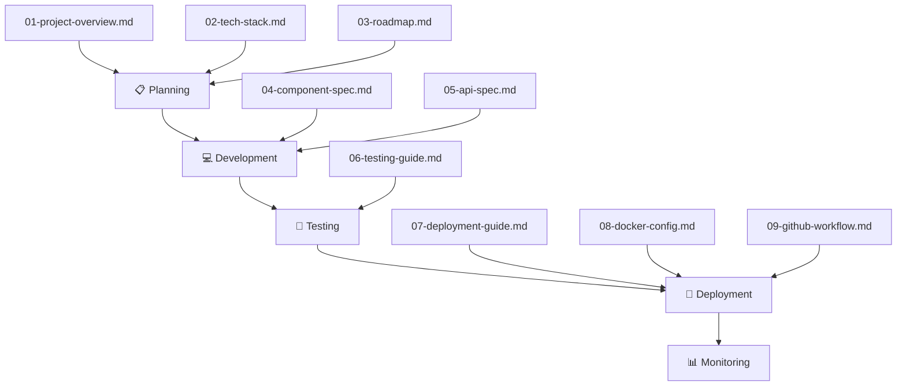

# THE CLIFF RESORT PWA - DOCUMENTATION INDEX

## 📚 Document Overview

Đây là bộ tài liệu đầy đủ cho dự án **The Cliff Resort In-Room Services PWA**. Các tài liệu này được sử dụng làm **tham chiếu chính** cho toàn bộ quá trình phát triển từ lên kế hoạch, thiết kế, xây dựng, kiểm thử đến triển khai.

---

## 📋 Document List

| # | Document | Mô tả | File |
|---|----------|-------|------|
| 1 | **Project Overview** | Tổng quan dự án, features, scope | [01-project-overview.md](./01-project-overview.md) |
| 2 | **Tech Stack** | Công nghệ, cấu trúc project, dependencies | [02-tech-stack.md](./02-tech-stack.md) |
| 3 | **Roadmap** | Lộ trình phát triển, milestones, timeline | [03-roadmap.md](./03-roadmap.md) |
| 4 | **Component Spec** | Đặc tả chi tiết các React components | [04-component-spec.md](./04-component-spec.md) |
| 5 | **API Spec** | External APIs, services, integrations | [05-api-spec.md](./05-api-spec.md) |
| 6 | **Testing Guide** | Unit tests, E2E tests, manual testing | [06-testing-guide.md](./06-testing-guide.md) |
| 7 | **Deployment Guide** | Local, Vercel, Docker, Arcane deployment | [07-deployment-guide.md](./07-deployment-guide.md) |
| 8 | **Docker Config** | Dockerfile, docker-compose, nginx | [08-docker-config.md](./08-docker-config.md) |
| 9 | **GitHub Workflow** | CI/CD, GitHub Actions, release process | [09-github-workflow.md](./09-github-workflow.md) |

---

## 🔄 Development Workflow

---

## 🎯 Quick Reference

### Phase 1: Planning (Đọc trước khi bắt đầu)
1. [01-project-overview.md](./01-project-overview.md) - Hiểu về dự án
2. [02-tech-stack.md](./02-tech-stack.md) - Setup môi trường
3. [03-roadmap.md](./03-roadmap.md) - Timeline và milestones

### Phase 2: Development
4. [04-component-spec.md](./04-component-spec.md) - Build components
5. [05-api-spec.md](./05-api-spec.md) - Integrate services

### Phase 3: Testing
6. [06-testing-guide.md](./06-testing-guide.md) - Run tests

### Phase 4: Deployment
7. [07-deployment-guide.md](./07-deployment-guide.md) - Deploy steps
8. [08-docker-config.md](./08-docker-config.md) - Docker setup
9. [09-github-workflow.md](./09-github-workflow.md) - CI/CD

---

## 📝 Key Information

### URLs
| Environment | URL |
|-------------|-----|
| Production | https://app.thecliffresort.com.vn |
| Staging | https://thecliff-staging.vercel.app |
| Local | http://localhost:3000 |

### Contacts
| Role | Name | Contact |
|------|------|---------|
| Project Manager | TBD | TBD |
| Developer Lead | TBD | TBD |
| Resort IT | TBD | TBD |

---

## ⚠️ Important Notes

> [!IMPORTANT]
> Các thông tin sau cần được xác nhận trước khi bắt đầu development:
> 1. WiFi credentials (SSID + Password)
> 2. Extension numbers cho từng dịch vụ
> 3. Số điện thoại khẩn cấp ưu tiên
> 4. Yêu cầu ngôn ngữ (Việt/Anh/Bilingual)

---

**Document Version**: 1.0  
**Created**: 2026-02-04  
**Last Updated**: 2026-02-04  
**Author**: Development Team
