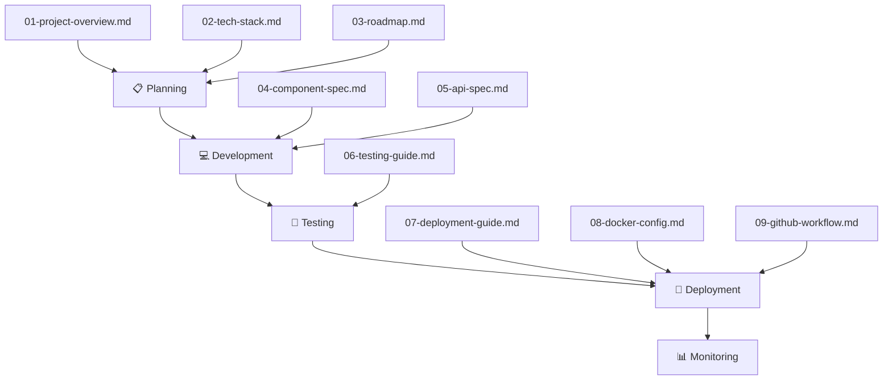

# THE CLIFF RESORT PWA - DOCUMENTATION INDEX

## 📚 Document Overview

Đây là bộ tài liệu đầy đủ cho dự án **The Cliff Resort In-Room Services PWA**. Các tài liệu này được sử dụng làm **tham chiếu chính** cho toàn bộ quá trình phát triển từ lên kế hoạch, thiết kế, xây dựng, kiểm thử đến triển khai.

---

## 🚀 Quick Start (Dành cho Developer Mới)

> **BẮT BUỘC đọc các file này trước khi bắt đầu code:**

| Priority | File | Nội dung |
|----------|------|----------|
| ⭐⭐⭐ | [RULES.md](./RULES.md) | Quy tắc phát triển, cấu trúc project |
| ⭐⭐⭐ | [PROGRESS.md](./PROGRESS.md) | Tiến độ hiện tại, việc đã/chưa làm |
| ⭐⭐ | [CHANGELOG.md](./CHANGELOG.md) | Lịch sử thay đổi |
| ⭐⭐ | [01-project-overview.md](./01-project-overview.md) | Tổng quan dự án |

---

## 📋 Document List

| # | Document | Mô tả | File |
|---|----------|-------|------|
| 0 | **Developer Rules** | Quy tắc, cấu trúc, conventions | [RULES.md](./RULES.md) |
| 0a | **Progress** | Tiến độ dự án | [PROGRESS.md](./PROGRESS.md) |
| 0b | **Changelog** | Lịch sử thay đổi | [CHANGELOG.md](./CHANGELOG.md) |
| 1 | **Project Overview** | Tổng quan dự án, features, scope | [01-project-overview.md](./01-project-overview.md) |
| 2 | **Tech Stack** | Công nghệ, cấu trúc project, dependencies | [02-tech-stack.md](./02-tech-stack.md) |
| 3 | **Roadmap** | Lộ trình phát triển, milestones, timeline | [03-roadmap.md](./03-roadmap.md) |
| 4 | **Component Spec** | Đặc tả chi tiết các React components | [04-component-spec.md](./04-component-spec.md) |
| 5 | **API Spec** | External APIs, services, integrations | [05-api-spec.md](./05-api-spec.md) |
| 6 | **Testing Guide** | Unit tests, E2E tests, manual testing | [06-testing-guide.md](./06-testing-guide.md) |
| 7 | **Deployment Guide** | Local, Vercel, Docker, Arcane deployment | [07-deployment-guide.md](./07-deployment-guide.md) |
| 8 | **Docker Config** | Dockerfile, docker-compose, nginx | [08-docker-config.md](./08-docker-config.md) |
| 9 | **GitHub Workflow** | CI/CD, GitHub Actions, release process | [09-github-workflow.md](./09-github-workflow.md) |
| 10 | **Admin Panel Spec** | Admin dashboard specifications | [10-admin-panel-spec.md](./10-admin-panel-spec.md) |
| 11 | **Database Recommendation** | Database analysis & migration plan | [11-database-recommendation.md](./11-database-recommendation.md) |

---

## 🔄 Development Workflow



---

## 📝 Key Information

### URLs
| Environment | URL |
|-------------|-----|
| Production | https://app.thecliffresort.com.vn |
| Staging | https://thecliff-app.vercel.app |
| Local | http://localhost:3001 |
| Admin Panel | http://localhost:3001/admin |

### Quick Commands
```bash
# Start development
npm run dev -- -p 3001

# Build for production
npm run build

# Admin login password (see .env.local)
thecliff@admin2026
```

---

## ⚠️ Important Notes

> [!IMPORTANT]
> Đọc RULES.md trước khi bắt đầu code!

> [!NOTE]
> Logs được lưu trong thư mục `logs/` - xem khi debug.

---

**Document Version**: 1.2  
**Created**: 2026-02-04  
**Last Updated**: 2026-02-05  
**Author**: Development Team

