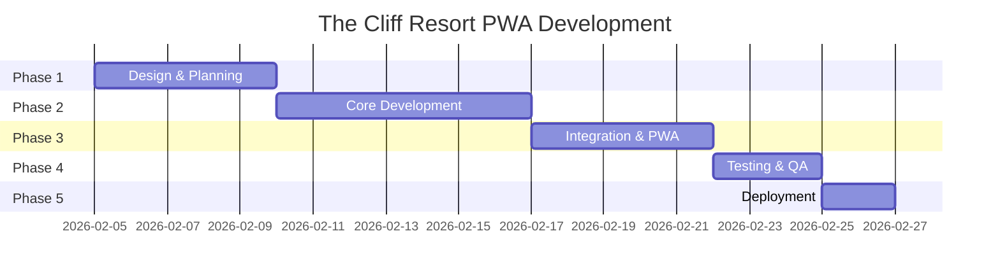

# DEVELOPMENT ROADMAP

## Timeline Overview



---

## Phase 1: Design & Planning (Week 1)
**Duration**: 5 ngày  
**Dates**: 05/02/2026 - 09/02/2026

### Tasks
| Task | Estimate | Owner | Deliverable |
|------|----------|-------|-------------|
| Xác nhận requirements với stakeholders | 1 ngày | PM | Meeting notes |
| Thiết kế UI/UX mockup (Figma) | 2 ngày | Designer | Figma file |
| Review & approve mockup | 1 ngày | Stakeholders | Approved designs |
| Setup project repository | 0.5 ngày | Dev | GitHub repo |
| Chuẩn bị assets (icons, images) | 0.5 ngày | Designer | Asset package |

### Milestones
- [ ] **M1.1**: Hoàn thành UI/UX mockup
- [ ] **M1.2**: Stakeholder approval 
- [ ] **M1.3**: Project repository ready

### Deliverables
1. Figma/Design file với đầy đủ screens
2. Asset package (icons, images, logo)
3. GitHub repository với branch strategy

---

## Phase 2: Core Development (Week 2)
**Duration**: 7 ngày  
**Dates**: 10/02/2026 - 16/02/2026

### Tasks
| Task | Estimate | Owner | Deliverable |
|------|----------|-------|-------------|
| Setup Next.js + Tailwind | 0.5 ngày | Dev | Project boilerplate |
| Implement Header component | 0.5 ngày | Dev | Header.tsx |
| Implement ServiceGrid + ServiceButton | 1 ngày | Dev | Components |
| Implement Footer component | 0.5 ngày | Dev | Footer.tsx |
| Implement WiFiModal | 1 ngày | Dev | WiFiModal.tsx |
| Implement EmergencyButton | 0.5 ngày | Dev | EmergencyButton.tsx |
| Implement SocialModal | 0.5 ngày | Dev | SocialModal.tsx |
| Layout assembly & styling | 1 ngày | Dev | Main page |
| Responsive testing | 0.5 ngày | Dev | Test report |
| Code review | 1 ngày | Lead | Reviewed code |

### Milestones
- [ ] **M2.1**: All components implemented
- [ ] **M2.2**: Responsive on all devices
- [ ] **M2.3**: Code review passed

### Deliverables
1. Hoàn thành tất cả React components
2. Responsive design (320px - 768px)
3. Clean, reviewed code

---

## Phase 3: Integration & PWA (Week 3)
**Duration**: 5 ngày  
**Dates**: 17/02/2026 - 21/02/2026

### Tasks
| Task | Estimate | Owner | Deliverable |
|------|----------|-------|-------------|
| PWA manifest configuration | 0.5 ngày | Dev | manifest.json |
| Service Worker setup | 1 ngày | Dev | sw.js |
| Offline capability | 1 ngày | Dev | Cached pages |
| Analytics integration (GA4) | 0.5 ngày | Dev | Tracking code |
| Phone call integration | 0.5 ngày | Dev | tel: links |
| External links testing | 0.5 ngày | Dev | Test results |
| WiFi connect testing | 0.5 ngày | Dev | Test results |
| Performance optimization | 0.5 ngày | Dev | Optimized build |

### Milestones
- [ ] **M3.1**: PWA installable
- [ ] **M3.2**: Offline mode working
- [ ] **M3.3**: All integrations functional

### Deliverables
1. Fully functional PWA
2. Google Analytics setup
3. Optimized performance (< 2s load)

---

## Phase 4: Testing & QA (Week 4 - Part 1)
**Duration**: 3 ngày  
**Dates**: 22/02/2026 - 24/02/2026

### Tasks
| Task | Estimate | Owner | Deliverable |
|------|----------|-------|-------------|
| Unit testing | 0.5 ngày | Dev | Test suite |
| Cross-browser testing | 1 ngày | QA | Test report |
| Mobile device testing | 1 ngày | QA | Device matrix |
| Bug fixing | 0.5 ngày | Dev | Fixed issues |

### Test Scenarios
| Scenario | Expected Result |
|----------|-----------------|
| QR Code scan (iPhone) | Opens PWA correctly |
| QR Code scan (Android) | Opens PWA correctly |
| All button clicks | Navigate to correct URL |
| Phone links | Open dialer app |
| WiFi connect (Android) | Auto-connect attempt |
| WiFi connect (iOS) | Modal with copy |
| Emergency button | Call confirmation + dial |
| Offline mode | Display cached content |
| Responsive 5"-7" | Correct layout |

### Milestones
- [ ] **M4.1**: All tests passed
- [ ] **M4.2**: Cross-browser compatibility
- [ ] **M4.3**: Zero critical bugs

### Deliverables
1. Test reports
2. Bug-free application
3. Performance benchmarks

---

## Phase 5: Deployment (Week 4 - Part 2)
**Duration**: 2 ngày  
**Dates**: 25/02/2026 - 26/02/2026

### Tasks
| Task | Estimate | Owner | Deliverable |
|------|----------|-------|-------------|
| Vercel staging deployment | 0.5 ngày | Dev | Staging URL |
| Staging testing | 0.5 ngày | QA | Test sign-off |
| Docker config for Arcane | 0.5 ngày | Dev | Docker files |
| Production deployment | 0.5 ngày | DevOps | Live URL |

### Deployment Stages
```
1. Local Development → localhost:3001
2. GitHub Push → Auto-build
3. Vercel Staging → staging.thecliffresort.com.vn  
4. Arcane/Docker Production → app.thecliffresort.com.vn
```

### Milestones
- [ ] **M5.1**: Staging deployment successful
- [ ] **M5.2**: Production deployment successful
- [ ] **M5.3**: QR Code ready for TV

### Deliverables
1. Live production URL
2. QR Code for TV display
3. Documentation handoff

---

## Post-Launch (Ongoing)

### Week 5+: Monitoring & Support
- Analytics monitoring
- Bug fixes (if any)
- Performance tuning
- Feature requests triage

### Future Enhancements (Phase 2)
- [ ] Multi-language support (EN/VI toggle)
- [ ] Room service ordering
- [ ] Push notifications
- [ ] Chat with reception
- [ ] Feedback collection

---

## Risk Register

| Risk | Impact | Probability | Mitigation |
|------|--------|-------------|------------|
| WiFi password exposure | High | Medium | Environment variables |
| Slow network at resort | Medium | High | Aggressive caching |
| iOS Safari limitations | Medium | High | Graceful fallbacks |
| QR Code not scannable | High | Low | High error correction |
| Scope creep | Medium | Medium | Strict phase gates |

---

## Success Metrics

| Metric | Target | Measurement |
|--------|--------|-------------|
| Page load time | < 2s | Lighthouse |
| PWA score | > 90 | Lighthouse |
| Button success rate | 100% | Manual testing |
| QR scan success | 100% | Device testing |
| User satisfaction | > 4/5 | Feedback |

---

**Document Version**: 1.0  
**Created**: 2026-02-04  
**Author**: Development Team
