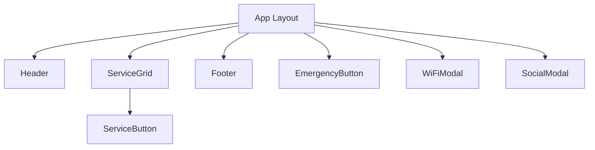

# COMPONENT SPECIFICATION

## 1. Component Overview



---

## 2. Component Details

### 2.1 Header Component

**File**: `src/components/Header.tsx`

#### Props
```typescript
interface HeaderProps {
  logoSrc?: string;
  showWifiButton?: boolean;
  onWifiClick?: () => void;
}
```

#### Structure
```tsx
<header className="header">
  {/* Logo */}
  <div className="logo-container">
    
  </div>
  
  {/* Welcome Message */}
  <div className="welcome-section">
    <h1>Welcome to The Cliff Resort</h1>
    <p>Your comfort, our priority</p>
  </div>
  
  {/* WiFi Button */}
  <button className="wifi-button" onClick={onWifiClick}>
    <WifiIcon />
    <span>Connect WiFi</span>
  </button>
</header>
```

#### Styling
| Property | Mobile | Tablet |
|----------|--------|--------|
| Padding | 16px | 24px |
| Logo height | 48px | 64px |
| Title size | 20px | 24px |
| Background | Linear gradient overlay on banner |

#### Behavior
- Logo click → Navigate to home page
- WiFi button → Open WiFiModal

---

### 2.2 ServiceGrid Component

**File**: `src/components/ServiceGrid.tsx`

#### Props
```typescript
interface Service {
  id: string;
  name: string;
  icon: string;
  action: 'link' | 'phone' | 'modal';
  url?: string;
  phone?: string;
  modalType?: 'social' | 'wifi';
}

interface ServiceGridProps {
  services: Service[];
  columns?: 2 | 3 | 4;
}
```

#### Structure
```tsx
<main className="service-grid">
  {services.map(service => (
    <ServiceButton 
      key={service.id}
      {...service}
    />
  ))}
</main>
```

#### Grid Layout
| Screen Width | Columns | Gap |
|--------------|---------|-----|
| 320px - 375px | 2 | 12px |
| 376px - 767px | 3 | 16px |
| 768px+ | 4 | 20px |

---

### 2.3 ServiceButton Component

**File**: `src/components/ServiceButton.tsx`

#### Props
```typescript
interface ServiceButtonProps {
  id: string;
  name: string;
  icon: string;
  action: 'link' | 'phone' | 'modal';
  url?: string;
  phone?: string;
  modalType?: 'social' | 'wifi';
  onClick?: () => void;
}
```

#### Structure
```tsx
<button 
  className="service-button"
  onClick={handleClick}
  aria-label={name}
>
  <div className="icon-container">
    {/* Icon - emoji or SVG */}
    <span className="icon">{icon}</span>
  </div>
  <span className="label">{name}</span>
</button>
```

#### Styling
| Property | Value |
|----------|-------|
| Min width | 90px |
| Min height | 80px |
| Padding | 12px |
| Border radius | 12px |
| Background | White |
| Shadow | 0 2px 8px rgba(0,0,0,0.1) |
| Icon size | 32px |
| Label size | 13px |

#### States
- Default: White background
- Hover: Light gray background
- Active/Pressed: Scale 0.95
- Focus: Ring outline

#### Action Handlers
```typescript
const handleClick = () => {
  switch(action) {
    case 'link':
      window.open(url, '_blank');
      trackEvent('button_click', { button: name });
      break;
    case 'phone':
      window.location.href = `tel:${phone}`;
      trackEvent('phone_call', { button: name });
      break;
    case 'modal':
      openModal(modalType);
      break;
  }
};
```

---

### 2.4 Footer Component

**File**: `src/components/Footer.tsx`

#### Props
```typescript
interface FooterProps {
  hotline: string;
  reservation: string;
  socialLinks: SocialLink[];
}

interface SocialLink {
  platform: 'facebook' | 'instagram' | 'zalo';
  url: string;
}
```

#### Structure
```tsx
<footer className="footer">
  {/* Contact Info */}
  <div className="contact-section">
    <a href={`tel:${hotline}`} className="contact-item">
      <PhoneIcon />
      <span>Hotline: {hotline}</span>
    </a>
    <a href={`tel:${reservation}`} className="contact-item">
      <BuildingIcon />
      <span>Reservation: {reservation}</span>
    </a>
  </div>
  
  {/* Social Icons */}
  <div className="social-section">
    {socialLinks.map(link => (
      <a 
        key={link.platform}
        href={link.url}
        target="_blank"
        rel="noopener"
        aria-label={link.platform}
      >
        <SocialIcon platform={link.platform} />
      </a>
    ))}
  </div>
  
  {/* Copyright */}
  <p className="copyright">
    © 2026 The Cliff Resort. All rights reserved.
  </p>
</footer>
```

#### Styling
| Property | Value |
|----------|-------|
| Background | #1A4D2E (primary) |
| Text color | White |
| Padding | 24px 16px |
| Social icon size | 32px |

---

### 2.5 WiFiModal Component

**File**: `src/components/WiFiModal.tsx`

#### Props
```typescript
interface WiFiModalProps {
  isOpen: boolean;
  onClose: () => void;
  ssid: string;
  password: string;
}
```

#### Structure
```tsx
<Modal isOpen={isOpen} onClose={onClose}>
  <div className="wifi-modal">
    <h2>Connect to WiFi</h2>
    
    {/* WiFi Info */}
    <div className="wifi-info">
      <div className="info-row">
        <label>Network Name (SSID)</label>
        <code>{ssid}</code>
      </div>
      <div className="info-row">
        <label>Password</label>
        <code>{password}</code>
        <button onClick={copyPassword}>
          <CopyIcon />
        </button>
      </div>
    </div>
    
    {/* Instructions */}
    <div className="instructions">
      <h3>How to connect:</h3>
      <ol>
        <li>Open Settings on your phone</li>
        <li>Tap on WiFi</li>
        <li>Select "{ssid}"</li>
        <li>Enter the password above</li>
      </ol>
    </div>
    
    <button className="close-btn" onClick={onClose}>
      Got it!
    </button>
  </div>
</Modal>
```

#### Features
- Copy password to clipboard with feedback toast
- Clear instructions for iOS users
- Android intent attempt before showing modal

---

### 2.6 EmergencyButton Component

**File**: `src/components/EmergencyButton.tsx`

#### Props
```typescript
interface EmergencyButtonProps {
  phoneNumber: string;
  position?: 'bottom-right' | 'bottom-left';
}
```

#### Structure
```tsx
<button 
  className="emergency-button"
  onClick={handleEmergencyClick}
  aria-label="Emergency - Call for help"
>
  <AlertIcon />
  <span className="sr-only">SOS</span>
</button>

{/* Confirmation Dialog */}
<Dialog
  isOpen={showConfirm}
  title="Emergency Call"
  message="Call emergency number?"
  onConfirm={makeCall}
  onCancel={closeDialog}
/>
```

#### Styling
```css
.emergency-button {
  position: fixed;
  bottom: 20px;
  right: 20px;
  width: 60px;
  height: 60px;
  border-radius: 50%;
  background: #DC2626;
  color: white;
  box-shadow: 0 4px 12px rgba(220, 38, 38, 0.4);
  animation: pulse 2s infinite;
  z-index: 1000;
}

@keyframes pulse {
  0%, 100% { transform: scale(1); }
  50% { transform: scale(1.05); }
}
```

#### Behavior
- Always visible (fixed position)
- Click → Show confirmation dialog
- Confirm → Make phone call
- Prevents accidental calls

---

### 2.7 SocialModal Component

**File**: `src/components/SocialModal.tsx`

#### Props
```typescript
interface SocialModalProps {
  isOpen: boolean;
  onClose: () => void;
  links: {
    facebook: string;
    instagram: string;
    zalo: string;
  };
}
```

#### Structure
```tsx
<Modal isOpen={isOpen} onClose={onClose}>
  <div className="social-modal">
    <h2>Follow Us</h2>
    
    <div className="social-buttons">
      <a href={links.facebook} className="social-btn facebook">
        <FacebookIcon />
        <span>Facebook</span>
      </a>
      <a href={links.instagram} className="social-btn instagram">
        <InstagramIcon />
        <span>Instagram</span>
      </a>
      <a href={links.zalo} className="social-btn zalo">
        <ZaloIcon />
        <span>Zalo</span>
      </a>
    </div>
  </div>
</Modal>
```

---

## 3. Service Configuration

**File**: `config/services.json`

```json
{
  "services": [
    {
      "id": "home",
      "name": "Home",
      "icon": "🏠",
      "action": "link",
      "url": "https://thecliffresort.com.vn"
    },
    {
      "id": "vista",
      "name": "Vista Restaurant",
      "icon": "🍽️",
      "action": "link",
      "url": "https://thecliffresort.com.vn/vista-restaurant/"
    },
    {
      "id": "book-table",
      "name": "Book Table",
      "icon": "📅",
      "action": "link",
      "url": "https://thecliffresort.com.vn/vista-restaurant/#booking"
    },
    {
      "id": "spa",
      "name": "Zest Spa",
      "icon": "💆",
      "action": "link",
      "url": "https://thecliffresort.com.vn/zest-spa/"
    },
    {
      "id": "front-desk",
      "name": "Front Desk",
      "icon": "🛎️",
      "action": "phone",
      "phone": "+842523719111"
    },
    {
      "id": "housekeeping",
      "name": "Housekeeping",
      "icon": "🧹",
      "action": "phone",
      "phone": "+842523719111"
    },
    {
      "id": "book-room",
      "name": "Book Room",
      "icon": "🛏️",
      "action": "link",
      "url": "https://thecliffresort.com.vn/rooms/"
    },
    {
      "id": "services",
      "name": "Guest Services",
      "icon": "ℹ️",
      "action": "link",
      "url": "https://thecliffresort.com.vn/contact/"
    },
    {
      "id": "activities",
      "name": "Activities",
      "icon": "🏊",
      "action": "link",
      "url": "https://thecliffresort.com.vn/blogs/"
    },
    {
      "id": "gallery",
      "name": "Share Memory",
      "icon": "📸",
      "action": "link",
      "url": "https://thecliffresort.com.vn/guest-book/"
    },
    {
      "id": "social",
      "name": "Social Media",
      "icon": "📱",
      "action": "modal",
      "modalType": "social"
    }
  ]
}
```

---

## 4. Shared Components

### 4.1 Modal Component

**File**: `src/components/ui/Modal.tsx`

```typescript
interface ModalProps {
  isOpen: boolean;
  onClose: () => void;
  children: React.ReactNode;
  title?: string;
}
```

### 4.2 Dialog Component

**File**: `src/components/ui/Dialog.tsx`

```typescript
interface DialogProps {
  isOpen: boolean;
  title: string;
  message: string;
  onConfirm: () => void;
  onCancel: () => void;
  confirmText?: string;
  cancelText?: string;
}
```

### 4.3 Toast Component

**File**: `src/components/ui/Toast.tsx`

```typescript
interface ToastProps {
  message: string;
  type: 'success' | 'error' | 'info';
  duration?: number;
}
```

---

## 5. Icon System

### Option A: Emoji Icons
- Pros: No additional assets, universal support
- Cons: Slightly different across platforms

### Option B: Custom SVG Icons
- Pros: Consistent design, scalable
- Cons: More work to create/maintain

### Recommended: Hybrid
- Use emoji for service buttons (quick, universal)
- Use SVG for social/UI icons (brand consistency)

---

**Document Version**: 1.0  
**Created**: 2026-02-04  
**Author**: Development Team
