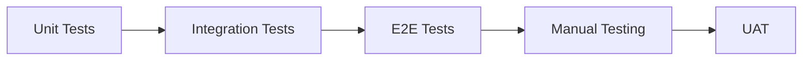

# TESTING GUIDE

## 1. Testing Strategy Overview



---

## 2. Testing Environments

| Environment | URL | Purpose |
|-------------|-----|---------|
| Local | `http://localhost:3001` | Development testing |
| Staging (Vercel) | `https://thecliff-staging.vercel.app` | QA testing |
| Production | `https://app.thecliffresort.com.vn` | Final verification |

---

## 3. Unit Testing

### 3.1 Test Framework
```bash
# Dependencies
npm install -D jest @testing-library/react @testing-library/jest-dom
```

### 3.2 Test Commands
```bash
# Run all tests
npm test

# Run with coverage
npm test -- --coverage

# Run specific test file
npm test -- ServiceButton.test.tsx

# Watch mode
npm test -- --watch
```

### 3.3 Unit Test Examples

```typescript
// __tests__/components/ServiceButton.test.tsx
import { render, screen, fireEvent } from '@testing-library/react';
import ServiceButton from '@/components/ServiceButton';

describe('ServiceButton', () => {
  it('renders with correct label', () => {
    render(
      <ServiceButton 
        id="test"
        name="Test Service"
        icon="🏠"
        action="link"
        url="https://example.com"
      />
    );
    expect(screen.getByText('Test Service')).toBeInTheDocument();
  });

  it('opens link on click', () => {
    const openSpy = jest.spyOn(window, 'open').mockImplementation();
    render(
      <ServiceButton 
        id="test"
        name="Test"
        icon="🏠"
        action="link"
        url="https://example.com"
      />
    );
    fireEvent.click(screen.getByRole('button'));
    expect(openSpy).toHaveBeenCalledWith('https://example.com', '_blank');
  });

  it('initiates phone call on click', () => {
    const locationSpy = jest.spyOn(window, 'location', 'get');
    render(
      <ServiceButton 
        id="test"
        name="Call"
        icon="📞"
        action="phone"
        phone="+842523719111"
      />
    );
    fireEvent.click(screen.getByRole('button'));
    // Assert location.href was set to tel: link
  });
});
```

```typescript
// __tests__/hooks/useWiFiConnect.test.tsx
import { renderHook, act } from '@testing-library/react';
import { useWiFiConnect } from '@/hooks/useWiFiConnect';

describe('useWiFiConnect', () => {
  it('shows modal on iOS', () => {
    // Mock iOS user agent
    Object.defineProperty(navigator, 'userAgent', {
      value: 'iPhone',
      configurable: true
    });
    
    const { result } = renderHook(() => useWiFiConnect());
    act(() => {
      result.current.connect();
    });
    expect(result.current.showModal).toBe(true);
  });

  it('copies password to clipboard', async () => {
    const mockClipboard = jest.fn();
    Object.assign(navigator, {
      clipboard: { writeText: mockClipboard }
    });
    
    const { result } = renderHook(() => useWiFiConnect());
    await act(async () => {
      await result.current.copyPassword();
    });
    expect(mockClipboard).toHaveBeenCalled();
  });
});
```

---

## 4. Integration Testing

### 4.1 Component Integration

```typescript
// __tests__/integration/App.test.tsx
import { render, screen } from '@testing-library/react';
import Home from '@/app/page';

describe('Home Page Integration', () => {
  it('renders all main sections', () => {
    render(<Home />);
    
    // Header
    expect(screen.getByAltText('The Cliff Resort')).toBeInTheDocument();
    expect(screen.getByText('Connect WiFi')).toBeInTheDocument();
    
    // Service buttons
    expect(screen.getByText('Vista Restaurant')).toBeInTheDocument();
    expect(screen.getByText('Front Desk')).toBeInTheDocument();
    
    // Footer
    expect(screen.getByText(/Hotline/)).toBeInTheDocument();
    
    // Emergency button
    expect(screen.getByLabelText('Emergency')).toBeInTheDocument();
  });

  it('has correct button count', () => {
    render(<Home />);
    const buttons = screen.getAllByRole('button');
    expect(buttons.length).toBeGreaterThanOrEqual(10);
  });
});
```

---

## 5. E2E Testing (Playwright)

### 5.1 Setup
```bash
npm install -D @playwright/test
npx playwright install
```

### 5.2 Playwright Config
```typescript
// playwright.config.ts
import { defineConfig, devices } from '@playwright/test';

export default defineConfig({
  testDir: './e2e',
  timeout: 30000,
  use: {
    baseURL: 'http://localhost:3001',
    screenshot: 'only-on-failure',
    video: 'retain-on-failure',
  },
  projects: [
    { name: 'Mobile Safari', use: devices['iPhone 13'] },
    { name: 'Mobile Chrome', use: devices['Pixel 5'] },
    { name: 'Tablet', use: devices['iPad Mini'] },
  ],
});
```

### 5.3 E2E Test Commands
```bash
# Run all E2E tests
npm run test:e2e

# Run with UI
npm run test:e2e -- --ui

# Run specific test
npx playwright test e2e/home.spec.ts
```

### 5.4 E2E Test Examples

```typescript
// e2e/home.spec.ts
import { test, expect } from '@playwright/test';

test.describe('Home Page', () => {
  test('loads within 2 seconds', async ({ page }) => {
    const start = Date.now();
    await page.goto('/');
    const loadTime = Date.now() - start;
    expect(loadTime).toBeLessThan(2000);
  });

  test('displays all service buttons', async ({ page }) => {
    await page.goto('/');
    
    const expectedButtons = [
      'Home', 'Vista Restaurant', 'Book Table',
      'Zest Spa', 'Front Desk', 'Housekeeping'
    ];
    
    for (const button of expectedButtons) {
      await expect(page.getByText(button)).toBeVisible();
    }
  });

  test('opens external link in new tab', async ({ page, context }) => {
    await page.goto('/');
    
    const [newPage] = await Promise.all([
      context.waitForEvent('page'),
      page.getByText('Vista Restaurant').click()
    ]);
    
    await expect(newPage).toHaveURL(/thecliffresort.com.vn/);
  });
});
```

```typescript
// e2e/wifi.spec.ts
import { test, expect } from '@playwright/test';

test.describe('WiFi Modal', () => {
  test('opens modal on WiFi button click', async ({ page }) => {
    await page.goto('/');
    await page.getByText('Connect WiFi').click();
    await expect(page.getByRole('dialog')).toBeVisible();
    await expect(page.getByText('Network Name')).toBeVisible();
  });

  test('copies password on button click', async ({ page }) => {
    await page.goto('/');
    await page.getByText('Connect WiFi').click();
    await page.getByRole('button', { name: /copy/i }).click();
    // Check for toast/feedback
    await expect(page.getByText('copied')).toBeVisible();
  });
});
```

```typescript
// e2e/emergency.spec.ts
import { test, expect } from '@playwright/test';

test.describe('Emergency Button', () => {
  test('is visible and red', async ({ page }) => {
    await page.goto('/');
    const sosButton = page.locator('.emergency-button');
    await expect(sosButton).toBeVisible();
    // Check position (bottom-right)
    const box = await sosButton.boundingBox();
    expect(box?.x).toBeGreaterThan(200);
  });

  test('shows confirmation before calling', async ({ page }) => {
    await page.goto('/');
    await page.locator('.emergency-button').click();
    await expect(page.getByText('Emergency Call')).toBeVisible();
    await expect(page.getByRole('button', { name: /cancel/i })).toBeVisible();
  });
});
```

---

## 6. Manual Testing Checklist

### 6.1 Device Testing Matrix

| Device | OS | Browser | Status |
|--------|-----|---------|--------|
| iPhone 12 | iOS 15+ | Safari | ⬜ |
| iPhone 14 | iOS 17 | Safari | ⬜ |
| Samsung Galaxy S21 | Android 12 | Chrome | ⬜ |
| Pixel 6 | Android 13 | Chrome | ⬜ |
| iPad Mini | iPadOS 16 | Safari | ⬜ |

### 6.2 Functional Test Cases

#### Header Section
| ID | Test Case | Steps | Expected | Pass |
|----|-----------|-------|----------|------|
| H1 | Logo displays | Load page | Logo visible | ⬜ |
| H2 | WiFi button works | Click "Connect WiFi" | Modal opens | ⬜ |
| H3 | Welcome text visible | Load page | "Welcome to..." text shown | ⬜ |

#### Service Buttons
| ID | Test Case | Steps | Expected | Pass |
|----|-----------|-------|----------|------|
| S1 | Home button | Click Home | Opens website | ⬜ |
| S2 | Vista Restaurant | Click Vista | Opens restaurant page | ⬜ |
| S3 | Book Table | Click Book Table | Opens booking section | ⬜ |
| S4 | Zest Spa | Click Spa | Opens spa page | ⬜ |
| S5 | Front Desk | Click Front Desk | Opens dialer with number | ⬜ |
| S6 | Housekeeping | Click Housekeeping | Opens dialer | ⬜ |
| S7 | Book Room | Click Book Room | Opens rooms page | ⬜ |
| S8 | Guest Services | Click Services | Opens contact page | ⬜ |
| S9 | Activities | Click Activities | Opens blogs | ⬜ |
| S10 | Share Memory | Click Share | Opens guest book | ⬜ |
| S11 | Social Media | Click Social | Opens social modal | ⬜ |

#### WiFi Modal
| ID | Test Case | Steps | Expected | Pass |
|----|-----------|-------|----------|------|
| W1 | Modal displays | Click WiFi button | SSID and password shown | ⬜ |
| W2 | Copy password | Click copy button | Password copied, toast shown | ⬜ |
| W3 | Close modal | Click close/outside | Modal closes | ⬜ |
| W4 | Android intent | Click WiFi on Android | Attempts auto-connect | ⬜ |

#### Emergency Button
| ID | Test Case | Steps | Expected | Pass |
|----|-----------|-------|----------|------|
| E1 | Button visible | Load page | Red SOS button visible | ⬜ |
| E2 | Confirmation | Click SOS | Confirmation dialog shows | ⬜ |
| E3 | Cancel | Click Cancel | Dialog closes, no call | ⬜ |
| E4 | Confirm | Click Confirm | Dialer opens with number | ⬜ |

#### Footer
| ID | Test Case | Steps | Expected | Pass |
|----|-----------|-------|----------|------|
| F1 | Hotline | Click hotline | Dialer with 1900 0394 | ⬜ |
| F2 | Reservation | Click reservation | Dialer with +84... | ⬜ |
| F3 | Facebook | Click FB icon | Opens Facebook page | ⬜ |
| F4 | Instagram | Click IG icon | Opens Instagram page | ⬜ |
| F5 | Zalo | Click Zalo | Opens Zalo page | ⬜ |

#### PWA Features
| ID | Test Case | Steps | Expected | Pass |
|----|-----------|-------|----------|------|
| P1 | Install prompt | Visit on mobile | Add to home available | ⬜ |
| P2 | Offline mode | Disconnect network | Shows cached content | ⬜ |
| P3 | Standalone mode | Open from home | No browser chrome | ⬜ |

### 6.3 Performance Testing

| Metric | Target | Tool | Result |
|--------|--------|------|--------|
| LCP | < 2.5s | Lighthouse | ⬜ |
| FID | < 100ms | Lighthouse | ⬜ |
| CLS | < 0.1 | Lighthouse | ⬜ |
| PWA Score | > 90 | Lighthouse | ⬜ |
| Performance | > 90 | Lighthouse | ⬜ |
| Accessibility | > 90 | Lighthouse | ⬜ |

### 6.4 QR Code Testing

| ID | Test Case | Steps | Expected | Pass |
|----|-----------|-------|----------|------|
| Q1 | iPhone scan | Scan QR with iPhone camera | Opens PWA | ⬜ |
| Q2 | Android scan | Scan QR with Android camera | Opens PWA | ⬜ |
| Q3 | QR reader app | Scan with third-party app | Opens PWA | ⬜ |
| Q4 | TV visibility | View QR on 55" TV from 3m | Scannable | ⬜ |

---

## 7. Accessibility Testing

### 7.1 Automated Tools
```bash
# axe-core
npm install -D @axe-core/playwright

# In Playwright tests
import AxeBuilder from '@axe-core/playwright';

test('should not have accessibility violations', async ({ page }) => {
  await page.goto('/');
  const results = await new AxeBuilder({ page }).analyze();
  expect(results.violations).toEqual([]);
});
```

### 7.2 Manual A11y Checks
| ID | Check | Method | Pass |
|----|-------|--------|------|
| A1 | Color contrast | WAVE extension | ⬜ |
| A2 | Keyboard navigation | Tab through page | ⬜ |
| A3 | Screen reader | VoiceOver/TalkBack | ⬜ |
| A4 | Focus visible | Check focus rings | ⬜ |
| A5 | Touch targets | Measure buttons | ⬜ |

---

## 8. Test Reports

### 8.1 Coverage Report
```bash
npm test -- --coverage --coverageReporters=html
# Opens coverage/index.html
```

### 8.2 Playwright Report
```bash
npx playwright show-report
```

### 8.3 Bug Report Template
```markdown
## Bug Report

**ID**: BUG-001
**Severity**: Critical/High/Medium/Low
**Device**: [Device name, OS version]
**Browser**: [Browser name, version]

### Steps to Reproduce
1. [Step 1]
2. [Step 2]
3. [Step 3]

### Expected Result
[What should happen]

### Actual Result
[What actually happened]

### Screenshot/Video
[Attach media]

### Notes
[Additional context]
```

---

**Document Version**: 1.0  
**Created**: 2026-02-04  
**Author**: Development Team
