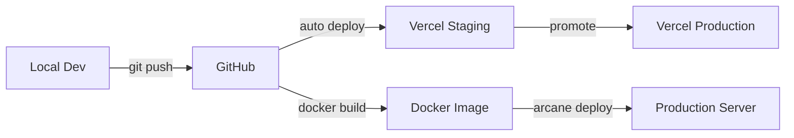

# DEPLOYMENT GUIDE

## 1. Deployment Architecture



---

## 2. Environment Setup

### 2.1 Environment Variables

```env
# .env.local (Development)
NEXT_PUBLIC_APP_URL=http://localhost:3000
NEXT_PUBLIC_APP_NAME="The Cliff Resort Services"
NEXT_PUBLIC_GA_ID=G-DEV123456
WIFI_SSID=TheCliffResort_Guest
WIFI_PASSWORD=TestPassword123

# .env.staging (Staging/Vercel)
NEXT_PUBLIC_APP_URL=https://thecliff-staging.vercel.app
NEXT_PUBLIC_APP_NAME="The Cliff Resort Services"
NEXT_PUBLIC_GA_ID=G-STAGING789
WIFI_SSID=TheCliffResort_Guest
WIFI_PASSWORD=********

# .env.production (Production)
NEXT_PUBLIC_APP_URL=https://app.thecliffresort.com.vn
NEXT_PUBLIC_APP_NAME="The Cliff Resort Services"
NEXT_PUBLIC_GA_ID=G-XXXXXXXXXX
WIFI_SSID=TheCliffResort_Guest
WIFI_PASSWORD=********
```

---

## 3. Local Development

### 3.1 Prerequisites
```bash
# Required
node >= 18.0.0
npm >= 9.0.0
git >= 2.30.0
```

### 3.2 Setup Steps
```bash
# Clone repository
git clone https://github.com/thecliffresort/thecliff-app.git
cd thecliff-app

# Install dependencies
npm install

# Copy environment file
cp .env.example .env.local
# Edit .env.local with your values

# Run development server
npm run dev

# Access at http://localhost:3000
```

### 3.3 Development Commands
```bash
# Development server (hot reload)
npm run dev

# Build for production
npm run build

# Start production server
npm start

# Run tests
npm test

# Run E2E tests
npm run test:e2e

# Lint code
npm run lint

# Format code
npm run format
```

---

## 4. GitHub Workflow

### 4.1 Branch Strategy
```
main          → Production branch
├── staging   → Staging/QA branch
└── develop   → Development branch
    ├── feature/xxx
    ├── bugfix/xxx
    └── hotfix/xxx
```

### 4.2 Commit Convention
```
feat: add new feature
fix: bug fix
docs: documentation update
style: formatting changes
refactor: code refactoring
test: add/update tests
chore: maintenance tasks
```

### 4.3 Pull Request Process
1. Create feature branch from `develop`
2. Make changes and commit
3. Push and create PR to `develop`
4. Code review + tests pass
5. Merge to `develop`
6. Merge `develop` → `staging` for QA
7. Merge `staging` → `main` for production

---

## 5. Vercel Deployment

### 5.1 Initial Setup

1. **Connect Repository**
   - Go to [vercel.com](https://vercel.com)
   - Import GitHub repository
   - Select `thecliff-app`

2. **Configure Project**
   ```
   Framework Preset: Next.js
   Build Command: npm run build
   Output Directory: .next
   Install Command: npm install
   ```

3. **Environment Variables**
   - Add all variables from `.env.production`
   - Mark sensitive variables as "Sensitive"

4. **Domain Configuration**
   - Add custom domain: `app.thecliffresort.com.vn`
   - Configure DNS CNAME record

### 5.2 Automatic Deployments

| Branch | Environment | URL |
|--------|-------------|-----|
| `main` | Production | app.thecliffresort.com.vn |
| `staging` | Preview | thecliff-staging.vercel.app |
| PR branches | Preview | thecliff-app-xxx.vercel.app |

### 5.3 Manual Deployment Commands
```bash
# Install Vercel CLI
npm i -g vercel

# Login
vercel login

# Deploy to preview
vercel

# Deploy to production
vercel --prod
```

### 5.4 Vercel Configuration
```json
// vercel.json
{
  "buildCommand": "npm run build",
  "outputDirectory": ".next",
  "framework": "nextjs",
  "regions": ["sin1"],
  "headers": [
    {
      "source": "/(.*)",
      "headers": [
        {
          "key": "X-Content-Type-Options",
          "value": "nosniff"
        },
        {
          "key": "X-Frame-Options",
          "value": "DENY"
        },
        {
          "key": "Strict-Transport-Security",
          "value": "max-age=31536000"
        }
      ]
    }
  ]
}
```

---

## 6. Docker Deployment

### 6.1 Dockerfile
```dockerfile
# Dockerfile
FROM node:18-alpine AS base

# Dependencies
FROM base AS deps
RUN apk add --no-cache libc6-compat
WORKDIR /app
COPY package*.json ./
RUN npm ci

# Builder
FROM base AS builder
WORKDIR /app
COPY --from=deps /app/node_modules ./node_modules
COPY . .

# Set environment variables for build
ARG NEXT_PUBLIC_APP_URL
ARG NEXT_PUBLIC_GA_ID
ENV NEXT_PUBLIC_APP_URL=$NEXT_PUBLIC_APP_URL
ENV NEXT_PUBLIC_GA_ID=$NEXT_PUBLIC_GA_ID

RUN npm run build

# Runner
FROM base AS runner
WORKDIR /app

ENV NODE_ENV production

RUN addgroup --system --gid 1001 nodejs
RUN adduser --system --uid 1001 nextjs

COPY --from=builder /app/public ./public
COPY --from=builder --chown=nextjs:nodejs /app/.next/standalone ./
COPY --from=builder --chown=nextjs:nodejs /app/.next/static ./.next/static

USER nextjs

EXPOSE 3000

ENV PORT 3000
ENV HOSTNAME "0.0.0.0"

CMD ["node", "server.js"]
```

### 6.2 Docker Compose
```yaml
# docker-compose.yml
version: '3.8'

services:
  thecliff-app:
    build:
      context: .
      dockerfile: Dockerfile
      args:
        - NEXT_PUBLIC_APP_URL=${NEXT_PUBLIC_APP_URL}
        - NEXT_PUBLIC_GA_ID=${NEXT_PUBLIC_GA_ID}
    container_name: thecliff-app
    ports:
      - "3000:3000"
    environment:
      - NODE_ENV=production
      - WIFI_SSID=${WIFI_SSID}
      - WIFI_PASSWORD=${WIFI_PASSWORD}
    restart: unless-stopped
    healthcheck:
      test: ["CMD", "curl", "-f", "http://localhost:3000/api/health"]
      interval: 30s
      timeout: 10s
      retries: 3

  # Optional: Nginx reverse proxy
  nginx:
    image: nginx:alpine
    container_name: thecliff-nginx
    ports:
      - "80:80"
      - "443:443"
    volumes:
      - ./nginx.conf:/etc/nginx/nginx.conf
      - ./ssl:/etc/nginx/ssl
    depends_on:
      - thecliff-app
    restart: unless-stopped
```

### 6.3 Docker Commands
```bash
# Build image
docker build -t thecliff-app:latest .

# Run container
docker run -d -p 3000:3000 --name thecliff-app thecliff-app:latest

# Using docker-compose
docker-compose up -d

# View logs
docker-compose logs -f thecliff-app

# Rebuild and restart
docker-compose up -d --build

# Stop
docker-compose down
```

---

## 7. Arcane Deployment

### 7.1 Arcane Configuration
```yaml
# arcane.yml
version: 1
name: thecliff-app
type: docker

build:
  dockerfile: Dockerfile
  context: .
  args:
    NEXT_PUBLIC_APP_URL: https://app.thecliffresort.com.vn
    NEXT_PUBLIC_GA_ID: G-XXXXXXXXXX

deploy:
  replicas: 2
  port: 3000
  health_check:
    path: /api/health
    interval: 30s

environment:
  - WIFI_SSID
  - WIFI_PASSWORD

resources:
  memory: 512Mi
  cpu: 0.5

domains:
  - app.thecliffresort.com.vn

ssl:
  enabled: true
  provider: letsencrypt
```

### 7.2 Arcane Commands
```bash
# Login to Arcane
arcane login

# Deploy
arcane deploy

# Check status
arcane status thecliff-app

# View logs
arcane logs thecliff-app

# Scale
arcane scale thecliff-app --replicas=3

# Rollback
arcane rollback thecliff-app --version=previous
```

---

## 8. Production Checklist

### Pre-Deployment
- [ ] All tests passing
- [ ] Build successful locally
- [ ] Environment variables configured
- [ ] SSL certificate ready
- [ ] DNS configured
- [ ] Analytics setup verified

### Deployment
- [ ] Deploy to staging first
- [ ] QA testing on staging
- [ ] No critical bugs
- [ ] Performance benchmarks met
- [ ] Deploy to production
- [ ] Verify production deployment

### Post-Deployment
- [ ] Smoke test all features
- [ ] Check analytics data
- [ ] Monitor error logs
- [ ] Test QR code on TV
- [ ] Notify stakeholders

---

## 9. Rollback Procedure

### 9.1 Vercel Rollback
```bash
# List deployments
vercel ls thecliff-app

# Rollback to previous
vercel rollback [deployment-id]
```

### 9.2 Docker Rollback
```bash
# Tag before deploy
docker tag thecliff-app:latest thecliff-app:backup

# Rollback
docker stop thecliff-app
docker run -d -p 3000:3000 --name thecliff-app thecliff-app:backup
```

### 9.3 Arcane Rollback
```bash
arcane rollback thecliff-app --version=previous
```

---

## 10. Monitoring

### 10.1 Health Endpoint
```typescript
// src/app/api/health/route.ts
export async function GET() {
  return Response.json({
    status: 'healthy',
    timestamp: new Date().toISOString(),
    version: process.env.npm_package_version
  });
}
```

### 10.2 Monitoring Tools
| Tool | Purpose | URL |
|------|---------|-----|
| Vercel Analytics | Performance | vercel.com/analytics |
| Google Analytics 4 | User behavior | analytics.google.com |
| Sentry | Error tracking | sentry.io |

---

**Document Version**: 1.0  
**Created**: 2026-02-04  
**Author**: Development Team
