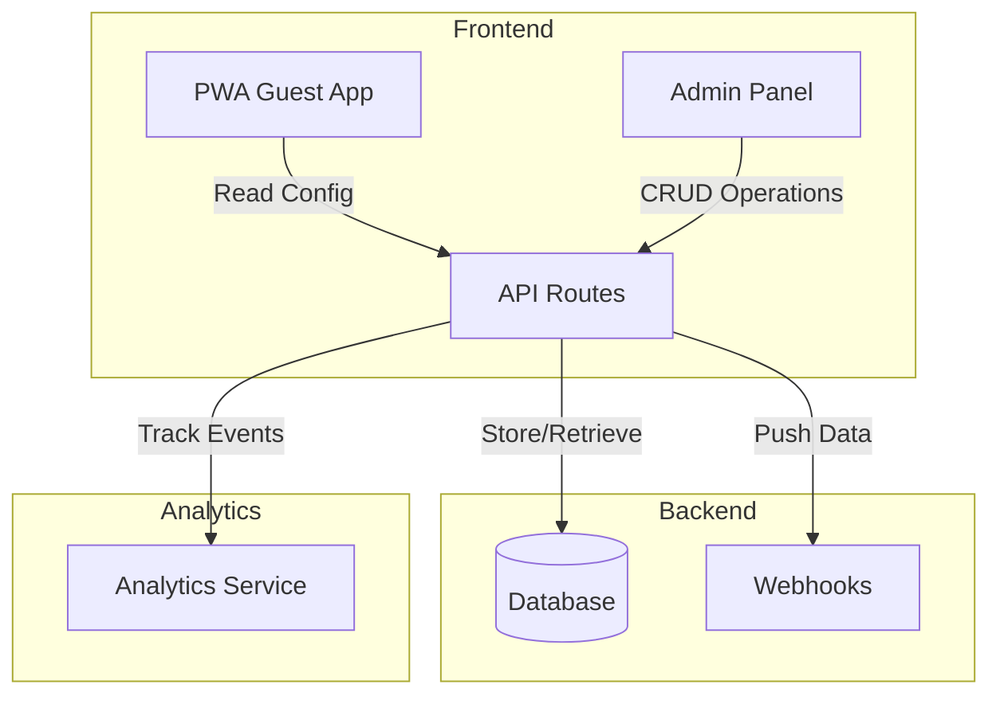
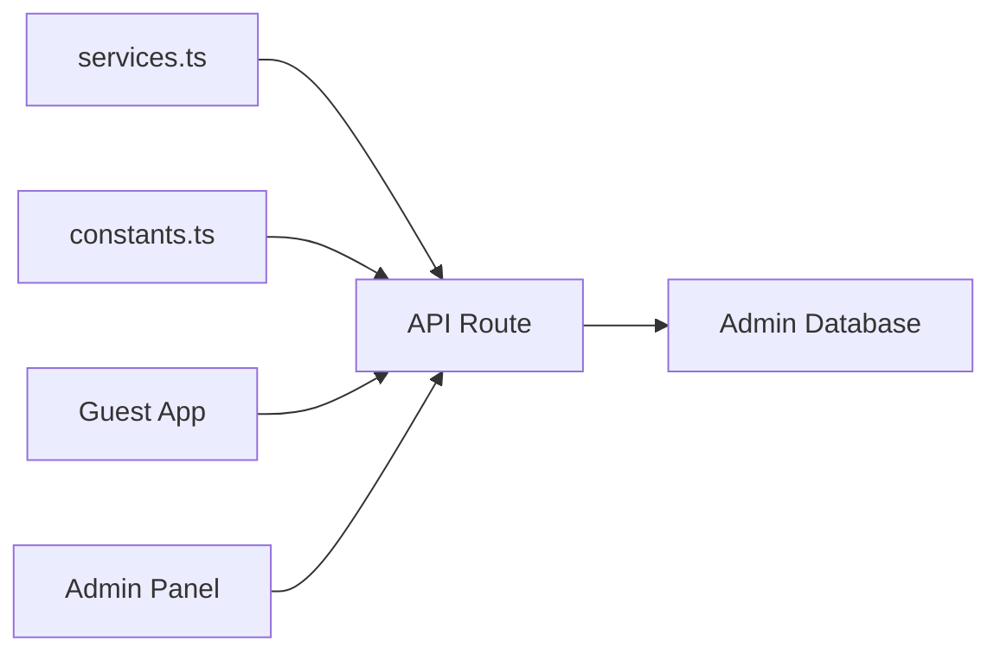

# ADMIN PANEL SPECIFICATION

## 1. Tổng quan

### 1.1 Mục tiêu
Xây dựng **Admin Panel** để quản lý động các thành phần của ứng dụng The Cliff Resort PWA:
- ✅ Quản lý buttons (thêm/sửa/xóa) với đầy đủ tùy chỉnh
- ✅ Quản lý số điện thoại (hotline, front desk, housekeeping...)
- ✅ Quản lý liên kết social media
- ✅ Dashboard thống kê (truy cập, clicks, forms)
- ✅ Quản lý dữ liệu forms (housekeeping request, order food, survey)
- ✅ Cấu hình webhooks để push dữ liệu

### 1.2 Kiến trúc hệ thống



---

## 2. Tính năng chi tiết

### 2.1 Quản lý Buttons

#### 2.1.1 Thông tin Button
| Field | Type | Required | Description |
|-------|------|----------|-------------|
| id | string | ✅ | Unique identifier |
| name | string | ✅ | Tên hiển thị (multi-language) |
| icon | string | ✅ | Emoji hoặc icon name |
| action | enum | ✅ | `link`, `phone`, `email`, `modal`, `zalo` |
| url | string | ❌ | URL (for `link` action) |
| phone | string | ❌ | Phone number (for `phone` action) |
| email | string | ❌ | Email address (for `email` action) |
| modalType | enum | ❌ | `wifi`, `housekeeping`, `orderfood`, `survey` |
| position | enum | ✅ | `header`, `body`, `footer` |
| order | number | ✅ | Thứ tự hiển thị |
| enabled | boolean | ✅ | Bật/tắt button |
| customStyle | object | ❌ | Custom CSS (color, size...) |

#### 2.1.2 Actions hỗ trợ
- **link**: Mở URL trong tab mới
- **phone**: Gọi điện thoại (tel:)
- **email**: Mở email client (mailto:)
- **modal**: Hiện popup modal
- **zalo**: Mở Zalo chat

### 2.2 Quản lý Số điện thoại

| Field | Type | Required | Description |
|-------|------|----------|-------------|
| id | string | ✅ | Unique identifier |
| label | string | ✅ | Nhãn hiển thị (VD: Hotline, Front Desk) |
| number | string | ✅ | Số điện thoại |
| type | enum | ✅ | `hotline`, `frontdesk`, `housekeeping`, `security`, `emergency`, `custom` |
| displayInFooter | boolean | ✅ | Hiển thị ở footer |
| order | number | ✅ | Thứ tự hiển thị |
| enabled | boolean | ✅ | Bật/tắt |

### 2.3 Quản lý Social Links

| Field | Type | Required | Description |
|-------|------|----------|-------------|
| id | string | ✅ | Unique identifier |
| platform | enum | ✅ | `facebook`, `instagram`, `youtube`, `zalo`, `tiktok`, `custom` |
| url | string | ✅ | URL liên kết |
| icon | string | ❌ | Custom icon (nếu platform=custom) |
| displayInFooter | boolean | ✅ | Hiển thị ở footer |
| order | number | ✅ | Thứ tự hiển thị |
| enabled | boolean | ✅ | Bật/tắt |

### 2.4 Dashboard & Analytics

#### 2.4.1 Metrics tracking
- **Page Views**: Lượt truy cập trang
- **Button Clicks**: Lượt bấm từng button
- **Form Submissions**: Số lượng form gửi đi
- **Device Types**: Mobile/Tablet/Desktop
- **Languages**: Ngôn ngữ được sử dụng

#### 2.4.2 Form Management
| Form Type | Data Fields |
|-----------|-------------|
| Housekeeping Request | room, requestType, time, notes, timestamp |
| Order Food | room, items[], deliveryTime, notes, timestamp |
| Survey/Review | room, rating, feedback, timestamp |

### 2.5 Webhook Configuration

| Field | Type | Required | Description |
|-------|------|----------|-------------|
| id | string | ✅ | Unique identifier |
| name | string | ✅ | Tên webhook |
| url | string | ✅ | Endpoint URL |
| events | array | ✅ | Events to trigger (form_submit, button_click...) |
| headers | object | ❌ | Custom headers (Auth, API Key...) |
| enabled | boolean | ✅ | Bật/tắt webhook |
| retryPolicy | object | ❌ | Retry settings |

---

## 3. Thiết kế Database Schema

### 3.1 Sử dụng JSON/LocalStorage (Phase 1 - Simple)

```typescript
// Database structure stored in localStorage or JSON file
interface AdminDatabase {
  buttons: Button[];
  phoneNumbers: PhoneNumber[];
  socialLinks: SocialLink[];
  webhooks: Webhook[];
  formSubmissions: FormSubmission[];
  analytics: AnalyticsEvent[];
  settings: AppSettings;
}
```

### 3.2 Database Option (Phase 2 - Production)

Khuyến nghị sử dụng một trong các options:
- **Supabase**: PostgreSQL + Real-time + Auth
- **Firebase Firestore**: NoSQL, real-time
- **Vercel KV/Postgres**: Tích hợp tốt với Next.js

---

## 4. API Routes Structure

```
/api/admin/
├── auth/
│   ├── login          POST - Admin login
│   └── logout         POST - Admin logout
├── buttons/
│   ├── index          GET - List all, POST - Create
│   └── [id]           GET, PUT, DELETE
├── phones/
│   ├── index          GET, POST
│   └── [id]           GET, PUT, DELETE
├── socials/
│   ├── index          GET, POST
│   └── [id]           GET, PUT, DELETE
├── webhooks/
│   ├── index          GET, POST
│   └── [id]           GET, PUT, DELETE
├── forms/
│   ├── housekeeping   GET - List submissions
│   ├── orderfood      GET - List submissions
│   └── survey         GET - List submissions
├── analytics/
│   ├── overview       GET - Dashboard stats
│   ├── clicks         GET - Button click stats
│   └── pageviews      GET - Page view stats
└── config/
    ├── export         GET - Export all config
    └── import         POST - Import config
```

---

## 5. Admin Panel UI Structure

### 5.1 Sidebar Navigation
```
📊 Dashboard
├── Overview
├── Analytics
└── Real-time Stats

⚙️ Configuration
├── 🔘 Buttons
├── 📞 Phone Numbers
├── 🌐 Social Links
└── 📶 WiFi Settings

📝 Form Data
├── 🧹 Housekeeping Requests
├── 🍔 Food Orders
└── ⭐ Reviews/Surveys

🔗 Integrations
├── Webhooks
└── API Keys

👤 Settings
├── Admin Users
└── Security
```

### 5.2 Page Components

#### Dashboard Page
- Summary cards (total visits, clicks, forms)
- Charts (daily/weekly/monthly trends)
- Recent activities feed
- Quick actions

#### Buttons Management Page
- Table view với filters
- Drag-drop reorder
- Inline edit hoặc modal edit
- Preview mode
- Position tabs (Header/Body/Footer)

#### Phone Numbers Page
- Simple table với CRUD
- Toggle enable/disable
- Quick edit

#### Social Links Page
- Card view với brand icons
- Toggle visibility
- URL validation

#### Form Submissions Pages
- Table với search & filters
- Export to CSV/Excel
- Mark as read/processed
- Date range filter

#### Webhooks Page
- CRUD webhooks
- Test webhook button
- Delivery logs

---

## 6. Tích hợp với App hiện tại

### 6.1 Thay đổi cần thiết



### 6.2 Files cần sửa đổi
| File | Change |
|------|--------|
| `src/config/services.ts` | Đọc từ API thay vì hardcode |
| `src/lib/constants.ts` | Đọc từ API thay vì hardcode |
| `src/app/page.tsx` | Thêm data fetching |
| `src/types/index.ts` | Thêm Admin types |

### 6.3 Files mới
| File | Purpose |
|------|---------|
| `src/app/admin/` | Admin panel pages |
| `src/app/api/admin/` | API routes |
| `src/lib/database.ts` | Database operations |
| `src/components/admin/` | Admin components |
| `src/hooks/useAdmin.ts` | Admin hooks |

---

## 7. Security

### 7.1 Authentication
- **Phase 1**: Simple password protection (environment variable)
- **Phase 2**: Full auth với sessions/JWT

### 7.2 Authorization
- Admin-only access to `/admin/*` routes
- API routes protected với auth middleware

### 7.3 Data Validation
- Input sanitization
- Type validation với Zod
- Rate limiting

---

## 8. Implementation Phases

### Phase 1: Core Features (1-2 tuần)
- [ ] Admin login page (simple password)
- [ ] Buttons CRUD
- [ ] Phone numbers CRUD
- [ ] Social links CRUD
- [ ] Basic dashboard

### Phase 2: Forms & Analytics (1 tuần)
- [ ] Form submissions storage
- [ ] Form submissions viewer
- [ ] Basic analytics tracking
- [ ] Export functionality

### Phase 3: Integrations (1 tuần)
- [ ] Webhook configuration
- [ ] Webhook delivery
- [ ] API documentation

### Phase 4: Advanced Features (optional)
- [ ] Real-time dashboard
- [ ] Multi-admin users
- [ ] Audit logs
- [ ] Backup/restore

---

**Document Version**: 1.0  
**Created**: 2026-02-05  
**Author**: Development Team
